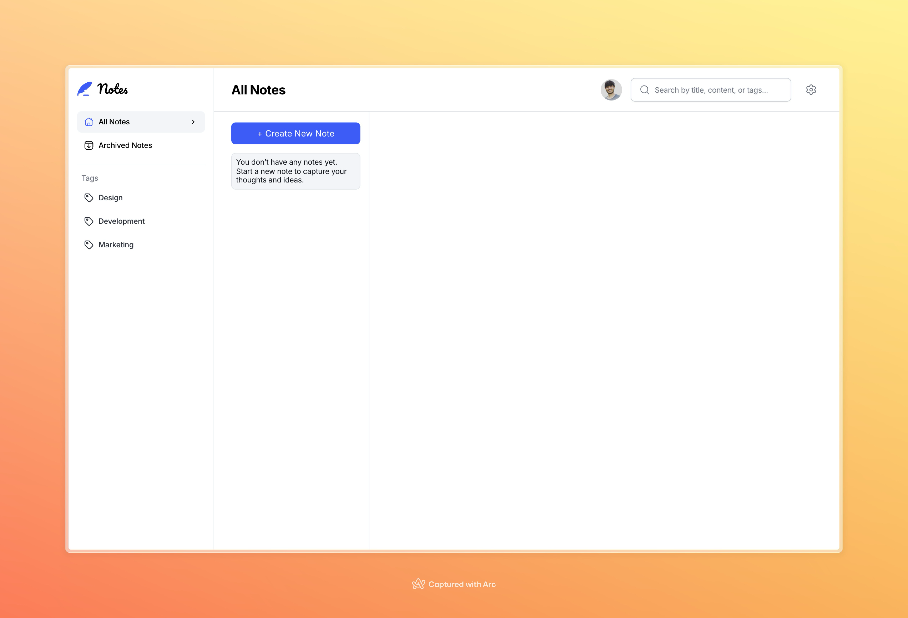

# Frontend Mentor - Note-taking web app solution

This is a solution to the [Note-taking web app challenge on Frontend Mentor](https://www.frontendmentor.io/challenges/note-taking-web-app-773r7bUfOG). Frontend Mentor challenges help you improve your coding skills by building realistic projects.

## Table of contents

- [Frontend Mentor - Note-taking web app solution](#frontend-mentor---note-taking-web-app-solution)
  - [Table of contents](#table-of-contents)
  - [Overview](#overview)
    - [The challenge](#the-challenge)
    - [Screenshot](#screenshot)
    - [Links](#links)
  - [My process](#my-process)
    - [Built with](#built-with)
  - [Author](#author)

## Overview

### The challenge

Users should be able to:

- Create, read, update, and delete notes
- Archive notes
- View all their notes
- View all archived notes
- View notes with specific tags
- Search notes by title, tag, and content
- Select their color theme
- Select their font theme
- Receive validation messages if required form fields aren't completed
- Navigate the whole app and perform all actions using only their keyboard
- View the optimal layout for the interface depending on their device's screen size
- See hover and focus states for all interactive elements on the page
- **Bonus**: Save details to a database (build the project as a full-stack app)
- **Bonus**: Create an account, log in, change password (add user authentication to the full-stack app)
- **Bonus**: Reset their password (add password reset to the full-stack app)

### Screenshot

### Links

- Solution URL: [Add solution URL here](https://your-solution-url.com)
- Live Site URL: [Add live site URL here](https://your-live-site-url.com)

## My process

### Built with

- Semantic HTML5 markup
- CSS custom properties
- Flexbox
- CSS Grid
- Mobile-first workflow
- [React](https://reactjs.org/) - JS library
- [Next.js](https://nextjs.org/) - React framework

## Author

- Website - [Pradeep Kaswan](https://www.your-site.com)
- Frontend Mentor - [@pradeepkaswan](https://www.frontendmentor.io/profile/pradeepkaswan)
- X - [@kaswanpradeep\_](https://www.x.com/kaswanpradeep_)
